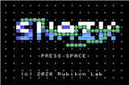
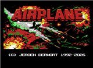
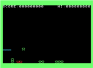

# Examples

Sample ROMs from MSX software **built with AI**. They are included here as inspiration — not every title used the same toolchain as [this template](README.md).

Load any `.rom` from `samples/` into openMSX (or another MSX emulator) to try them.

| ROM | WebMSX | Description | AI stack |
| --- | --- | --- | --- |
| [`helloworld.rom`](samples/helloworld.rom) | — | Simple template demo: prints a greeting, waits for SPACE, then exits. Source in this repo: `src/main.c`. | This repo stack |
|  [`snAIk.rom`](samples/snAIk.rom) | [snAIk](https://download.file-hunter.com/assets/webmsx.html?url=https%3A%2F%2Fdownload.file-hunter.com%2FGames%2FMSX1%2FROM%2FsnAIk%2520-%2520Rubikon%2520Lab%2520(2026).zip) | MSX1-style Snake game by [Rubikon Lab](https://rubikonlab.com). | This repo stack |
|  [`airplane.rom`](samples/airplane.rom) | [Airplane](http://webmsx.org/?ROM=https://www.jeroenderwort.nl/wp-content/uploads/airplane.rom) | Airplane demo / AI game by Jeroen Derwort. [Project article](https://www.jeroenderwort.nl/airplane-mijn-eerste-msx-game-opnieuw-gebouwd-in-assembly/) (Dutch). | Antigravity IDE → Claude + Gemini LLM → Z80 ASM + SjASMPlus → openMSX (no MCP connector) |
|  [`martians.rom`](samples/martians.rom) | [Martians](https://webmsx.org/?ROM=https://github.com/thomzwg/martians/raw/refs/heads/main/build/martians.rom) | Port of *The Martians* (Acornsoft, July 1981) from Acorn Atom BASIC to MSX by Thom Zwagers. See on [GitHub](https://github.com/thomzwg/martians). | Claude Code → Sonnet → Z80 ASM + Glass → openMSX (no MCP connector) |
|  [`boss.rom`](samples/boss.rom) | — | Port of *Soccer Boss* (“The Boss”, Alternative Software, 1987) from MSX BASIC to Z80 assembly by Thom Zwagers. See on [GitHub](https://github.com/thomzwg/TheBoss/tree/main). | Claude Code → Sonnet → Z80 ASM + Glass → openMSX (no MCP connector) |

More examples welcome — share your AI-built MSX projects and we can add them here.
